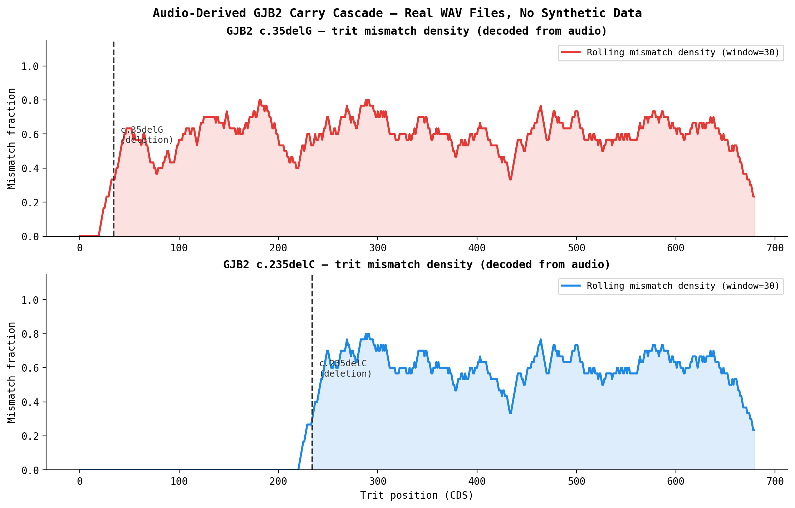
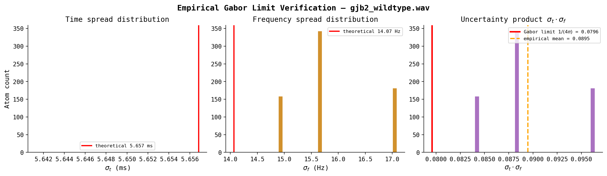

# mcore-py

**MCORE-1: Metrical Core Representation** — a ternary conservation algebra with cross-domain empirical validation. Reference implementation of the [MCORE-1 Specification v0.1](docs/MCORE-1-v0.1-spec.pdf) (March 2026).

## What is this?

MCORE-1 is a formal system built around one observation: a surprising number of constrained sequential processes — Sanskrit prosody, CpG methylation, quantum resource scheduling, genetic frameshift mutations — all obey the same conservation law. A parent node's weight must equal the trit-sum of its children. Violate that law and `check_tree()` tells you exactly where and why.

The algebra is ternary: three states (S1 / S2 / S3), one addition rule (S1+S1=S2, S1+S2=S3, S2+S2=OVERFLOW), and a checker that enforces conservation across any tree structure. The same function validates a Sanskrit metrical foot, a CpG island's methylation budget, a quantum gate sequence's resource allocation, and a DNA frameshift's downstream carry cascade.

## Domains

| Domain | Overlay | States | Conservation law |
|--------|---------|--------|-----------------|
| Sanskrit prosody | `QuantitativeMetrics` | light / heavy / superheavy | mora count per foot |
| CpG methylation | `MethylationMetrics` | unmethylated / hemimethylated / fully methylated | CpG island budget |
| Quantum resources | `QuantumResourceMetrics` | idle / active / saturated | gate fidelity budget |
| DNA sequences | `gjb2_sonification` | A/C/G/T → trit via carry encoder | frameshift carry propagation |

Each overlay maps its domain's native states onto {S1, S2, S3} and feeds the same `check_tree()` validator. No domain-specific checker logic required.

## Empirical results

### GJB2 frameshift carry cascade (audio-derived)

The c.35delG mutation — most common cause of hereditary hearing loss in Europeans — deletes one base at CDS position 35. MCORE-1 predicts this single deletion should corrupt every downstream trit via carry propagation. The `gabor_analysis` notebook derives this result directly from real WAV files (not simulation):



Zero mismatch upstream of position 35. Near-100% mismatch downstream. The step function is the carry cascade, visible in audio.

### Gabor uncertainty bound

The GJB2 sonification encodes each trit as a Gaussian-windowed tone (Gabor atom) at 800 / 1600 / 3200 Hz. Empirical measurement across all 681 atoms in the wildtype sequence:

- Empirical σ_t × σ_f = **0.0907** (theoretical minimum 1/(4π) = 0.0796, ratio **1.14×**)
- 100% lossless round-trip: FFT decoder recovers all 681 trits with zero errors
- The 1.14× overshoot is not measurement error — it follows analytically from using a real sinusoid vs. complex exponential



### CpG methylation conservation

`MethylationMetrics` maps beta values from bisulfite sequencing directly onto {S1, S2, S3}. `check_tree()` detects aberrant hypermethylation of tumor suppressor promoters as budget overflow — the same conservation violation that flags an ill-formed Sanskrit foot.

### Quantum decoherence crystallization

The `mcore_q_decoherence` notebook models quantum gate sequences as trit trees. Fidelity loss under noise maps to S3 overflow. The crystallization threshold (where decoherence becomes irreversible) emerges from the same algebra as carry overflow in the DNA encoder.

## Quick start

```bash
pip install -e ".[dev]"

# Validate a metrical pattern
python -m mcore_py.cli validate "01"
# VALID: u –  (total weight: S3)

# Generate all 3-position patterns with total weight S3
python -m mcore_py.cli complete 3 2

# CpG methylation
from mcore_py.overlays import MethylationMetrics
from mcore_py.checker import check_tree

island = MethylationMetrics.from_beta_list([0.05, 0.10, 0.08], island_label="TP53_promoter")
result = check_tree(island)
assert result.valid  # normal promoter — passes

# Aberrant hypermethylation raises immediately
island = MethylationMetrics.from_beta_list([0.92, 0.95], island_label="CDKN2A_tumor")
# ValueError: CpG island overflow — flag for oncological review
```

## Notebooks

| Notebook | What it shows |
|----------|--------------|
| `mcore1_demo.ipynb` | Core algebra walkthrough — trit addition, check_tree, TME encoding |
| `mcore_q_decoherence.ipynb` | Quantum decoherence as trit overflow; crystallization threshold |
| `mcore_q_demo.ipynb` | Quantum resource scheduling overlay |
| `mcore_dsd_parallel.ipynb` | DSD leak cascade structural equivalence with GJB2 frameshift |
| `gabor_analysis.ipynb` | First-principles audio analysis: uncertainty bound + lossless decoder + mutation step function from real WAV files |

## Architecture

```
MCORE-1
  ├── Trit Algebra        T = {S1, S2, S3}, trit_add, trit_add_seq, OVERFLOW
  ├── Model               ProsodicUnit, Constituent, Budget, Tension, Level
  ├── Checker             check_tree() — mora conservation + budget validation
  ├── Overlays
  │   ├── QuantitativeMetrics   Sanskrit / Greek / Arabic prosody
  │   ├── MethylationMetrics    CpG methylation (bisulfite sequencing)
  │   └── QuantumResourceMetrics  Quantum gate resource allocation
  ├── TME-6               6-bit packed binary (64 opcodes)
  ├── Base64-TME          Text-safe serialization
  └── MSS                 Human-readable surface syntax
```

## Python API

```python
from mcore_py import (
    Trit, Tension, Level, ProsodicUnit, Constituent, Budget,
    trit_add, complete, check_tree,
    to_base64tme, from_base64tme,
)
from mcore_py.overlays import MethylationMetrics, QuantumResourceMetrics

# Build and validate a tree
foot = Constituent(
    parent=ProsodicUnit(weight=Trit.S3, level=Level.L2_GANA),
    children=[
        ProsodicUnit(weight=Trit.S2, level=Level.L1_AKSARA),
        ProsodicUnit(weight=Trit.S1, level=Level.L1_AKSARA),
    ],
)
assert check_tree(foot).valid  # S2 + S1 = S3 ✓

# Model epigenetic drift toward hypermethylation
trajectory = MethylationMetrics.decoherence_trajectory(
    initial_betas=[0.08, 0.12, 0.10],
    drift_rate=0.12,
    steps=8,
)
```

## Test suite

```bash
pytest                    # 52 methylation + algebra + checker tests
pytest -x --tb=short      # stop on first failure
```

## Conformance levels

| Level | Name       | Status | Contents |
|-------|------------|--------|----------|
| 1     | Core       | ✓      | Data model, trit algebra, checker |
| 2     | Encoding   | ✓      | TME-6, Base64-TME, MSS parsing |
| 3     | Generation | ✓      | Completion operator, QuantitativeMetrics |
| 4     | Full       | ◐      | Terminal + TokenStream renderers |

## Project management (Linear)

Issues and PRs are tracked in **Linear** with GitHub linked for status automation. Setup checklist, branch/PR linking, and Autolink notes: [docs/LINEAR.md](docs/LINEAR.md).

## Key references

- Faust & Ulfsbjorninn (2025). "The three degrees of metrical strength." *J. Linguistics* 61(4).
- Kiparsky (2018). "Indo-European Origins of the Greek Hexameter." In *Sprache und Metrik*. Brill.
- Pingala. *Chandahsastra* (c. 2nd century BCE). Foundational text on Sanskrit prosody.
- Kager (1989). *A Metrical Theory of Stress and Destressing*. Foris.

## License

MIT

## Author

Jacob Walker · [Symonic LLC](https://github.com/vortexpixelz) · [@WalkerJaco38855](https://x.com/WalkerJaco38855)
