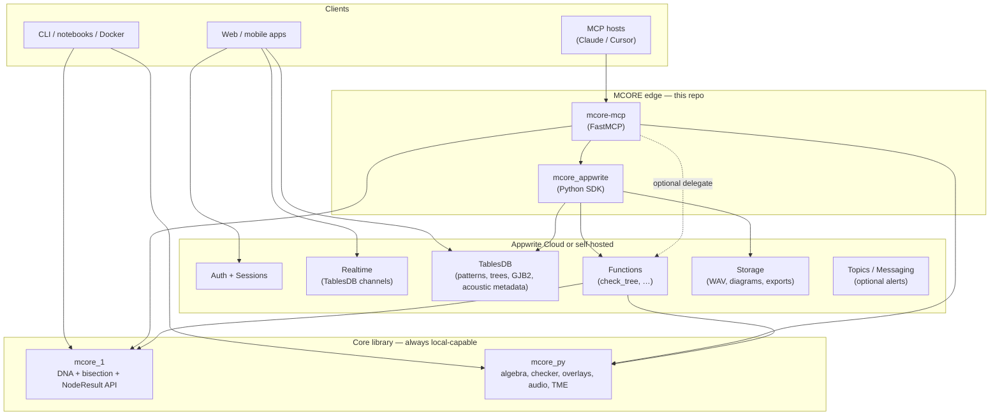

# MCORE-1 on Appwrite: architecture

This document describes how the **mcore-1** repository layers **Appwrite** (auth, TablesDB, Functions, Storage, Realtime) on top of the unchanged **`src/mcore_py`** and **`src/mcore_1`** packages. Local installs, the CLI, Docker, and notebooks remain the default path; Appwrite is **opt-in** via environment variables.

## Design goals

1. **Single source of truth for math** — all conservation, overlays, DNA carry, and bisection-tree logic stay in Python under `src/`.
2. **Thin edge** — Appwrite Functions are IO adapters + auth context; heavy work calls `mcore_1` / `mcore_py`.
3. **AI-native surface** — a **FastMCP** server (`mcore-mcp`) exposes the same operations to Claude Desktop / Cursor; when configured, it can delegate to Appwrite Functions and persist rows via TablesDB.
4. **Synergy with Appwrite MCP-for-API** — use the official generator (`appwrite generate`) for typed DB access in TypeScript clients; this repo’s MCP server focuses on **domain tools** (trits, trees, GJB2), not raw CRUD.
5. **Observability** — optional **PostHog** server-side events on MCP tool calls and Function executions (no PII in properties; sequence lengths and success flags only).

> **Note:** [Cloudflare Agents SDK](https://developers.cloudflare.com/agents/) targets Workers/Durable Objects. This stack is **Appwrite + Python**; agents-sdk is not a runtime dependency here.

## Architecture (Mermaid)



## Text diagram

```
                    ┌─────────────────────────────────────┐
                    │           Clients                    │
                    │  Web / mobile / paper repo / CLI    │
                    └──────────────┬──────────────────────┘
                                   │
          ┌────────────────────────┼────────────────────────┐
          │                        │                        │
          ▼                        ▼                        ▼
 ┌─────────────────┐    ┌──────────────────┐    ┌─────────────────────┐
 │ Appwrite Auth   │    │ Appwrite Realtime │    │  MCP clients        │
 │ + Sessions      │    │ (table channels)  │    │  (Claude / Cursor)  │
 └────────┬────────┘    └─────────┬─────────┘    └──────────┬──────────┘
          │                       │                          │
          └───────────────────────┼──────────────────────────┘
                                  │
                                  ▼
                    ┌─────────────────────────────┐
                    │  mcore-mcp (FastMCP)         │
                    │  stdio / HTTP                 │
                    │  optional: TablesDB + Funcs   │
                    └─────────────┬───────────────┘
                                  │
              ┌───────────────────┼───────────────────┐
              │                   │                   │
              ▼                   ▼                   ▼
    ┌─────────────────┐  ┌─────────────────┐  ┌─────────────────────┐
    │ TablesDB        │  │ Appwrite        │  │ Local in-process    │
    │ (patterns,      │  │ Functions       │  │ mcore_1 / mcore_py  │
    │  trees, GJB2)   │  │ check_tree, …   │  │ (default, no cloud) │
    └─────────────────┘  └────────┬────────┘  └─────────────────────┘
                                    │
                                    ▼
                          ┌───────────────────┐
                          │  Python 3.12      │
                          │  src/mcore_1      │
                          │  src/mcore_py     │
                          └───────────────────┘
```

## Monorepo layout

| Path | Role |
|------|------|
| `src/mcore_py/` | Core algebra, checker, overlays, TME — **unchanged contract** |
| `src/mcore_1/` | DNA carry encoder, bisection tree, `check_tree` / `check_deletion` API |
| `src/mcore_mcp/` | FastMCP server, optional Appwrite + PostHog wiring |
| `src/mcore_appwrite/` | Admin client + Function execution helpers |
| `functions/` | Appwrite Function source (one folder per function) |
| `appwrite/` | Example `appwrite.config.json`, table snippets, deploy notes |
| `docs/` | This file, schema, setup, migration, deployment |

## Data flow: `check_tree` (DNA-aware)

1. Client sends DNA or trit list to MCP tool `mcore_check_tree` (or HTTP to Function).
2. If `dna` is provided, `mcore_1.encoder.dna_to_trits` produces leaf weights.
3. `mcore_1.check_tree.check_tree` runs bisection + `mcore_py.checker`.
4. Optional: persist snapshot to **BisectionTreeRuns** / **GJB2Results** tables (user-scoped permissions).
5. PostHog: `mcp_tool_completed` with `{ tool, ok, n_leaves }` (no raw DNA when possible — pass `redacted: true`).

## Security

- Never commit API keys. Use Appwrite **scoped API keys** for server backends; user data uses **row-level security** (`rowSecurity: true`) and per-row permissions (`read("user:USER_ID")`).
- MCP over HTTP must sit behind TLS and auth (API key or OAuth proxy); stdio is the safest default for desktop MCP.

## Related docs

- [APPWRITE_DATABASE_SCHEMA.md](./APPWRITE_DATABASE_SCHEMA.md)
- [APPWRITE_QUICKSTART.md](./APPWRITE_QUICKSTART.md) — one-command local + deploy flows
- [APPWRITE_DEPLOYMENT.md](./APPWRITE_DEPLOYMENT.md)
- [MIGRATION_APPWRITE.md](./MIGRATION_APPWRITE.md)
- [HANDOFF_TO_GJB2.md](../HANDOFF_TO_GJB2.md)
